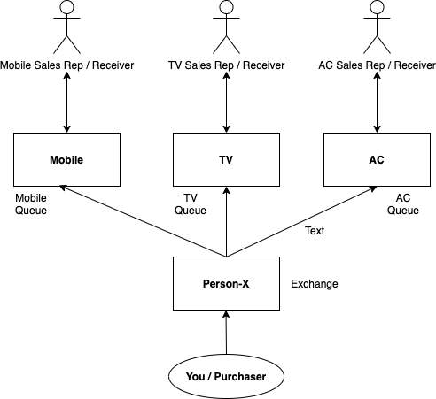
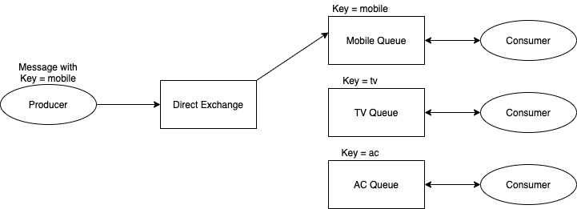

# Learn Rabbit MQ

## Understanding of JMS and RabbitMQ

### JMS
Java Messaging System (JMS)

Here is the typical example of JMS architecture overview. 

Here is the type JMS example:

### Real Time Example

### Type of JMS Exchanges
There are FOUR different types of exchanges available in JMS
 - Direct
 - Fanout
 - Headers
 - Topic
 
##Direct Exchange
### What is Direct Exchange
- This type of messages will first goto the Exchanges.
- From Exchange, it will pass to Queue
- From Queue to consumer
- In order to bind a Queue in Exchange we have to provide a "Key"

Steps to follow to create Exchange and Queue:
- First: Create a Exchange with type as Direct (ex: direct-exchange)
- Second: Create three different Queues namely "Mobile", "TV" and "AC"
- Third: Attach the created Queue in Exchange under `Bindings` using `Add binding from this exchange` with `Queue Name` and `Routing Key`.

>TIP: By using this `Direct Exchange` `Message Producer` will talk to `Exchange` whereas `Message Consumer` will talk to `Queue` to get the message.

> For Source code refer `com.techstack.queue.direct` package

