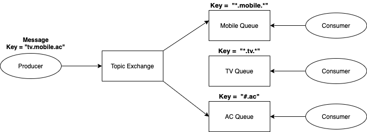
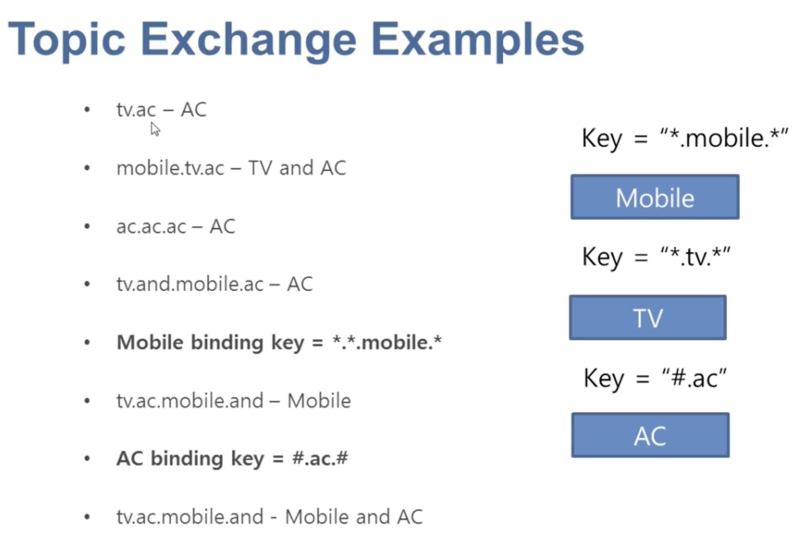
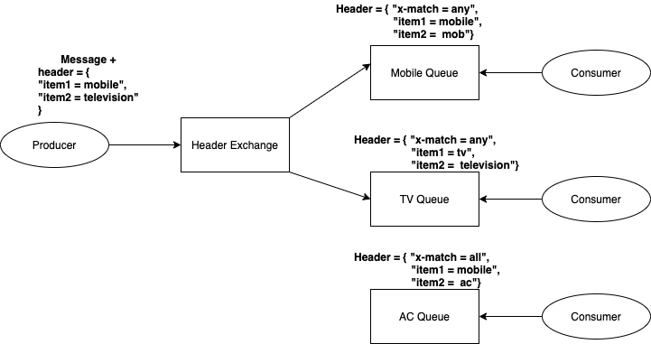

# Learn Rabbit MQ

## Understanding of JMS and RabbitMQ

### JMS
Java Messaging System (JMS)

Here is the typical example of JMS architecture overview. 


Here is the type JMS example:


### Real Time Example


### Type of JMS Exchanges
There are FOUR different types of exchanges available in JMS
 - Direct
 - Fanout
 - Headers
 - Topic
 
##Direct Exchange
### What is Direct Exchange
- This type of messages will first goto the Exchanges.
- Through Exchange, message will pass to Queue using binding key
- From Queue to consumer
- In order to bind a Queue in Exchange we have to provide a "Key"


Steps to follow to create Direct Exchange and Queue:
- First: Create a Exchange with type as Direct (ex: direct-exchange)
- Second: Create three different Queues namely "Mobile", "TV" and "AC"
- Third: Attach the created Queue in Exchange under `Bindings` using `Add binding from this exchange` with `Queue Name` and `Routing Key`.

>TIP: By using this `Direct Exchange` `Message Producer` will talk to `Exchange` whereas `Message Consumer` will talk to `Queue` to get the message.

> For Source code refer `com.techstack.queue.direct` package

##Fanout Exchange
### What is Fanout Exchange
- This type of messages will first goto the Exchanges.
- Through Exchange, message will pass to **EACH** Queue which is associated with this Exchange
- From Queue to consumer
- In order to bind a Queue in Exchange we have to provide a "Key"


Typical example for Fanout Exchange is Publish-Subscribe model like Group Message or Bulk Email or other form of Group Messages.  

Steps to follow to create Fanout Exchange and Queue:
- First: Create a FanoutExchange with type as Fanout (ex: fanout-exchange)
- Second: Create two different Queues namely "Mobile" and "AC"
- Third: Attach the created Queue in FanoutExchange under `Bindings` using `Add binding from this exchange` with `Queue Name`.

>TIP: By using this `Fanout Exchange` `Message Producer` will talk to `Exchange` whereas `Message Consumer` will talk to `Queue` to get the message.

> For Source code refer `com.techstack.queue.fanout` package

##Topic Exchange
### What is Topic Exchange
- This type of messages will first goto the Topic Exchanges.
- 



Steps to follow to create Topic Exchange and Queue:
- First: Create a FanoutExchange with type as Fanout (ex: fanout-exchange)
- Second: Create two different Queues namely "Mobile" and "AC"
- Third: Attach the created Queue in FanoutExchange under `Bindings` using `Add binding from this exchange` with `Queue Name`.

Key points:
- Producer side, message created with `key` separated by `.`(dot). For example: `tv.mobile.ac`
- Topic Exchange would identify those keys `*.mobile.*`. Which means `*` means `eactly one word` before and after the mobile.
- `#.ac` here `#` means `any number of words` before `ac`
- Here in the above diagram, TV expresion `*.tv.*` doesn't satisfy the TOPIC Exchange key format. Hence, message will not 
moved to it's Queue. Expected is `tv.*.*`

Some Examples about Topic Key:


>TIP: By using this `Topic Exchange` `Message Producer` will talk to `Exchange` whereas `Message Consumer` will talk to `Queue` to get the message.

> For Source code refer `com.techstack.queue.topic` package

##Header Exchange
### What is Header Exchange
Messages with Header from Producer side will talk to HeaderExchange and based on the Exchange Header Configuration it would
route the message to specific Queue based on the `Header "x-match = any | all"`. Here `any` is a `OR` condition and `all` means `AND` condition.



For example: 
* It's a key value pair from producer side.
```json
header = {
"item1 = mobile",
"item2 = television"
}
```
* In the Header Exchange settings, it is configured as `x-match = any` which means inside the incoming message
`any` of the `key = value` matched attached with this Exchange Queue, the message would route to that Queue.
```json
Header = { "x-match = any",
           "item1 = mobile",
           "item2 =  mob"
         }
```

### How to create a Header Exchange?
Once you created a Header Exchange in AMQP Server, you have to select the `Bindings`. Under the Bindings section, select `Queue Name` and use `arguments` `key` = `value` select 
appropriate `data type`

>TIP: By using this `Header Exchange` `Message Producer` will talk to `Exchange` whereas `Message Consumer` will talk to `Queue` to get the message.

> For Source code refer `com.techstack.queue.headers` package

## Default Exchange
### What is Default Exchange
Basically Default Exchange is type of Direct Exchange which doesn't have any name.  
If you open RabbitMQ Exchanges tab you will see `(AMQP fefault)` which is of type `direct`.  


# RabbitMQ with Spring Boot
Spring Boot and RabbitMQ provides 
- RabbitMQ Template - To Produce Message
- RabbitMQ Listener - To Consume Message

For Producer Example: Refer `com.techstack.rabbitmq.controller.RabbitMqController#processName`

# Pivotal Cloud Foundry
- Cloud Foundry is an open source cloud Platform As A Service (PaaS) on which developers can build, deploy, run and scale application.
- Setting Up Pivotal Cloud Foundry and Creating Organization and CLI installation
- Creating RabbitMQ service
- Spring Boot Deployment
- Spring Boot Deployment using Spring Cloud (Dependency)

### Steps to Create a RabbitMQ cloud service
- Login to your [PCF Console](https://console.run.pivotal.io)
- Click on the Marketplace and search for "CloudAMQP" service
- Select Free Plan called "Little Lemur"
- Create a service with your "Service-Name"
- Once service instance up and running, click **Manage** button. It will open a Cloud AMQP.
- In the LHS you will find **RabbitMQ Manager**
    - Alternatively you can use **Hosts** information
    - It will ask you to enter username and password

